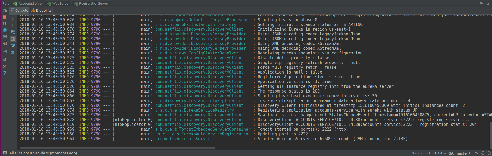
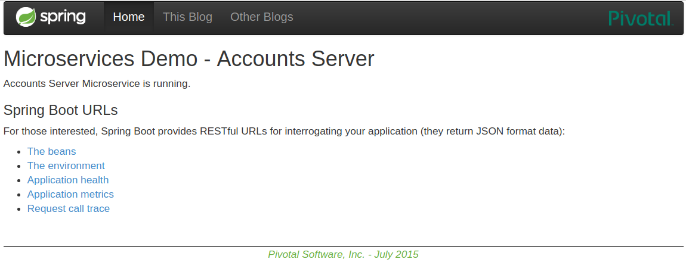
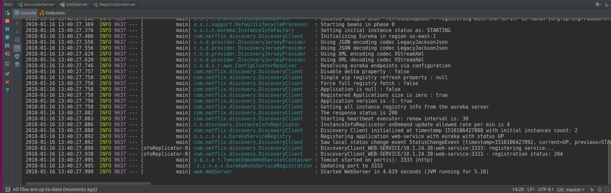
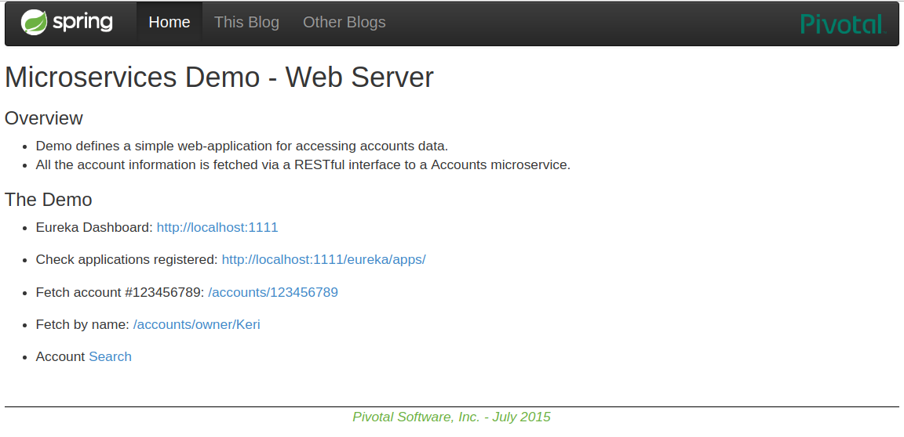
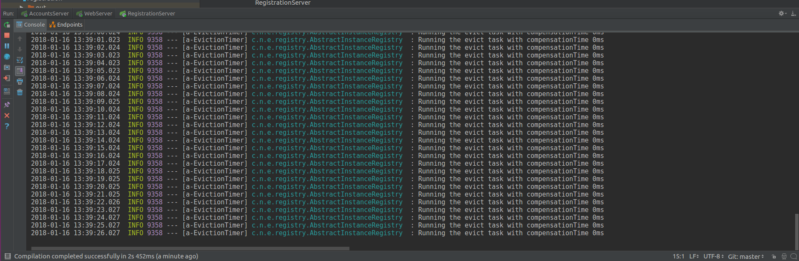
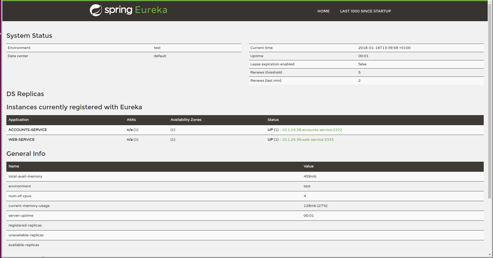
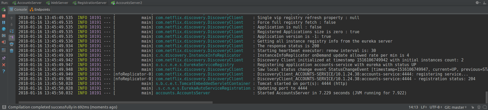
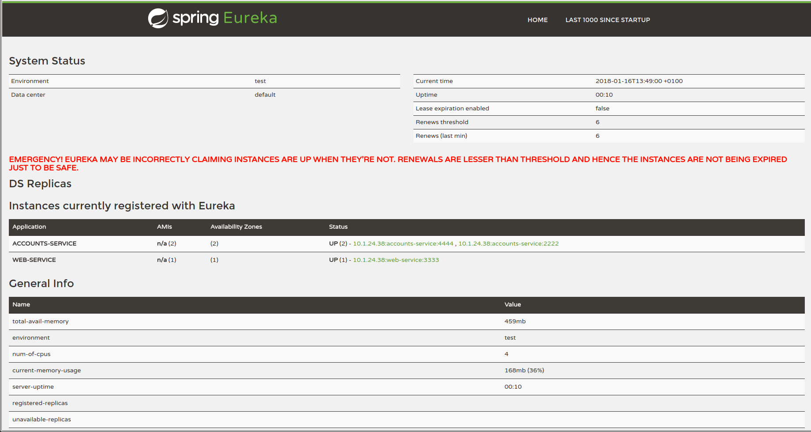

• The two microservices are running and registered:

* Account service

* Web Server

* The service registration service has the two microservices registered

* A second account microservice is running in the port 4444 and it is registered

* What happens when you kill the microservice with port 2222. Can the web service provide information about the accounts? Why?
When you kill the account server with port 2222, the web service returns a connection refused error when it makes a petition to the service killed. If you try to get information aobut de account service with port 4444, there is not a problem.
